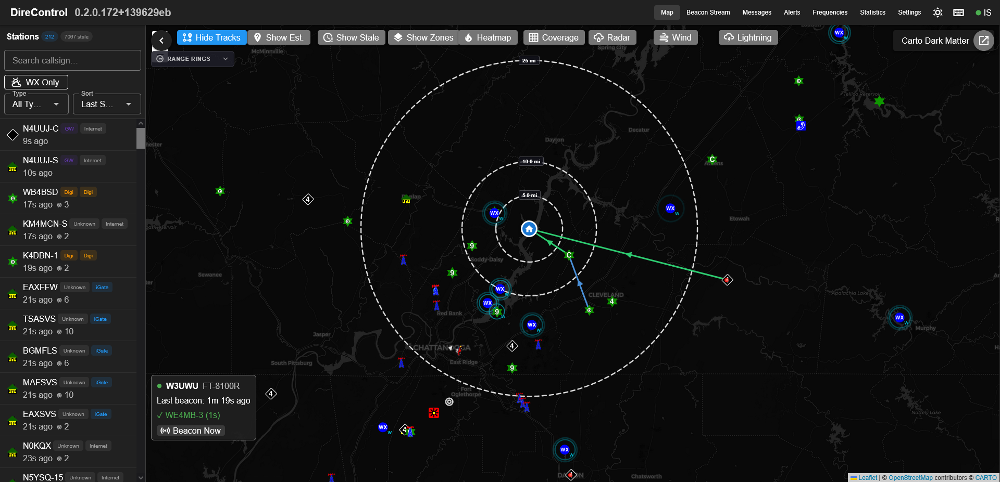

# DireControl

A real-time APRS (Automatic Packet Reporting System) monitoring and control application with a built-in AFSK-1200 soundcard modem — point it at an ALSA audio device and receive RF directly, no external TNC required. An external KISS TCP TNC ([Direwolf](https://github.com/wb2osz/direwolf) or hardware) is still supported as an alternate/parallel RF backend. Aggregates packets from local RF and APRS-IS, provides interactive mapping, messaging, alerting, and beacon management for ham radio operators.



## Features

- **Native sound modem** — Software AFSK-1200 modem (DSP in C#: tone correlators, PLL clock recovery, HDLC/AX.25 codec) reading and transmitting straight through an ALSA sound device, with live audio level/DCD/TX status in the UI
- **Radio control** — PTT via serial RTS/DTR, CM108 USB HID (DigiRig), Linux GPIO, or hamlib rigctld (with rig frequency display); p-persistence CSMA channel access with carrier sense
- **Digipeater** — WIDEn-N with callsign substitution, path trapping (WIDE7-7 abuse), fill-in mode, and 30 s duplicate suppression
- **KISS TCP server** — other applications can use DireControl as their TNC
- **Bidirectional iGate** — RF→IS gating with the qAR construct, and IS→RF message gating (third-party format) for stations recently heard on RF
- **Signal telemetry** — live 0–4 kHz waterfall in the browser, per-packet audio level and demodulator profile, decode statistics
- **Real-time packet capture** — Native modem and/or Direwolf via KISS TCP, parses AX.25 frames, and classifies stations by type (Mobile, Fixed, Weather, Digipeater, IGate)
- **APRS-IS integration** — Dual-source packet aggregation from RF and internet with configurable filters and deduplication
- **Interactive map** — Leaflet-based map with station plotting, APRS symbols, track history, range rings, heatmap overlay, and Maidenhead grid coverage analysis
- **Messaging** — Send and receive APRS messages with automatic retry and acknowledgment tracking
- **Beacon management** — Multi-radio beacon configuration with digipeater confirmation tracking and heard/not-heard status
- **Alerting** — Watch list alerts, proximity rules, and geofences with real-time notifications
- **Weather overlays** — NEXRAD radar (IEM), RainViewer Pro, lightning (Tomorrow.io), and wind tiles (OpenWeatherMap)
- **Callsign lookup** — HamDB and QRZ integration with result caching
- **Statistics** — Coverage grid analysis, digipeater statistics, packet rates, and per-station metrics
- **Real-time updates** — SignalR pushes all events (packets, messages, alerts, beacon confirmations) to the browser instantly

## Tech Stack

| Layer    | Technology                              |
|----------|-----------------------------------------|
| Backend  | ASP.NET Core (.NET 10), Entity Framework Core, SQLite |
| Frontend | Vue 3, Vuetify 4, Vite, TypeScript, Pinia |
| Mapping  | Leaflet                                 |
| Realtime | SignalR                                 |
| APRS     | AprsSharp (KISS TNC + APRS-IS + parser) |

## Docker

The easiest way to run DireControl is with Docker Compose. Copy `docker-compose.yml` and `.env.example` from the repo, then:

```bash
cp .env.example .env
# Edit .env — at minimum set DireControl__OurCallsign to your callsign
docker compose up -d
```

The app will be available at `http://localhost`. The SQLite database is persisted in a `data/` directory alongside the compose file.

### Docker Compose

```yaml
services:
  direcontrol:
    image: roushtech/direcontrol:${VERSION:-stable}
    env_file: .env
    ports:
      - "${HTTP_PORT:-80}:5010"
      # KISS TCP server — uncomment (and enable in Settings) to let other
      # apps on your network use DireControl as their TNC
      # - "8010:8010"
    volumes:
      - ./data:/data
    restart: unless-stopped
    # Allows the container to reach Direwolf running on the host via host.docker.internal
    extra_hosts:
      - "host.docker.internal:host-gateway"
    # Hardware passthrough for the native sound modem — uncomment `devices:`
    # plus the entries you use (compose fails if a listed device is missing):
    # devices:
    #   - /dev/snd:/dev/snd            # sound cards (modem RX/TX audio)
    #   - /dev/ttyUSB0:/dev/ttyUSB0    # serial RTS/DTR PTT
    #   - /dev/hidraw0:/dev/hidraw0    # CM108 PTT (DigiRig etc.)
    #   - /dev/gpiochip0:/dev/gpiochip0  # GPIO PTT (Pi hats)
```

### Configuration

DireControl is configured through environment variables and the in-app Settings page.

**Environment variables** (set in `.env` or passed to the container):

| Variable | Default | Description |
|----------|---------|-------------|
| `HTTP_PORT` | `80` | Host port to expose the web UI on |
| `DireControl__OurCallsign` | `N0CALL-10` | Your callsign with SSID |
| `DireControl__HomeLat` / `DireControl__HomeLon` | *(unset)* | Home position for beacons and distance calculations |
| `Direwolf__Host` | `localhost` | Direwolf KISS TCP host (`host.docker.internal` for Docker) |
| `Direwolf__Port` | `8001` | Direwolf KISS TCP port |
| `QRZ__Username` / `QRZ__Password` | *(empty)* | QRZ callsign lookup credentials (optional — HamDB is used as a free fallback) |
| `DireControl__StationExpiryTimeoutMinutes` | `120` | Default minutes before inactive stations expire |

See `.env.example` for the full list including per-type station expiry overrides.

**In-app settings** (configured through the Settings page in the UI):

- APRS-IS connection (host, port, filter, passcode)
- Weather API keys (OpenWeatherMap, Tomorrow.io, RainViewer)
- Radar provider selection

### Image Tags

The `stable` tag always points to the latest release. Pinned version tags (e.g. `0.2.0.173`) are also available — see [Docker Hub](https://hub.docker.com/r/roushtech/direcontrol/tags) for all tags.

## Building from Source

### Prerequisites

- [.NET 10 SDK](https://dotnet.microsoft.com/download)
- [Node.js](https://nodejs.org/) 20.19+ or 22.12+
- [Direwolf](https://github.com/wb2osz/direwolf) running with KISS TCP enabled

### Backend

```bash
dotnet run --project DireControl.Api
# Listening on http://localhost:5010
```

### Frontend

```bash
cd DireControl.Vue
npm install
npm run dev
```

The Vite dev server proxies API and SignalR requests to the backend automatically.

### Local Configuration

Copy and edit the local settings override (git-ignored):

```bash
cp DireControl.Api/appsettings.json DireControl.Api/appsettings.local.json
```

The same settings from the environment variable table above can be set here using the nested JSON format (e.g. `Direwolf__Host` becomes `"Direwolf": { "Host": "..." }`).

## Running Tests

```bash
dotnet test DireControl.Tests/DireControl.Tests.csproj
```

## License

[MIT](LICENSE) — Copyright (c) 2026 William Roush / RoushTech
